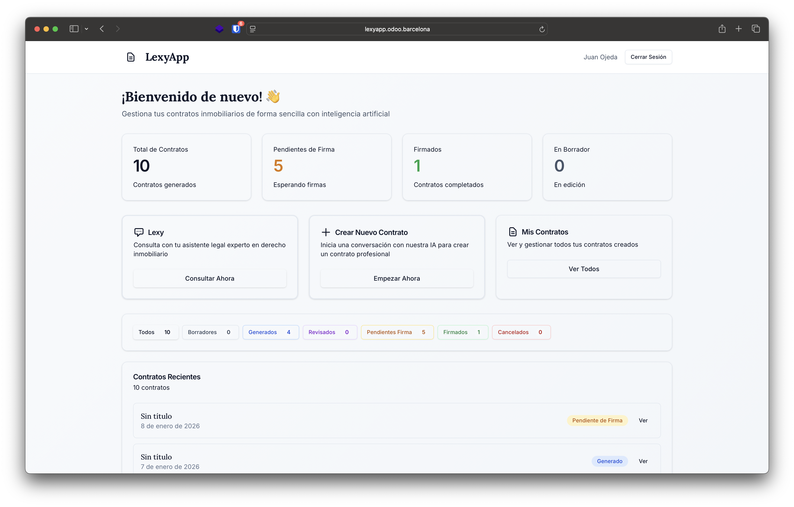
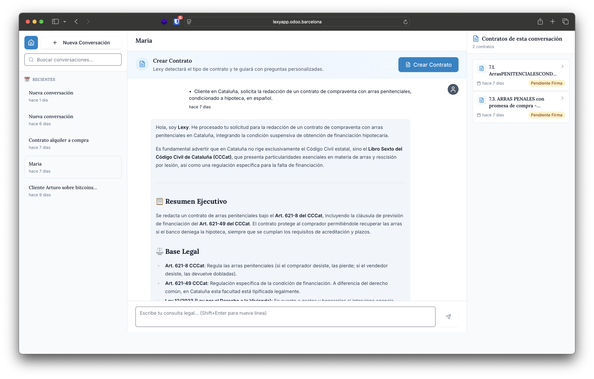
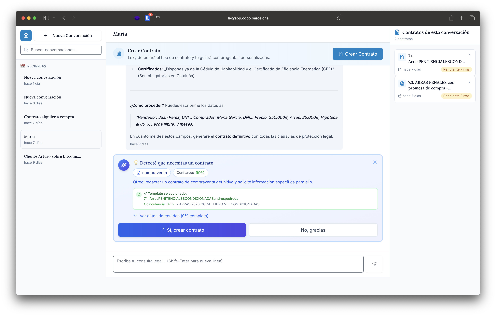
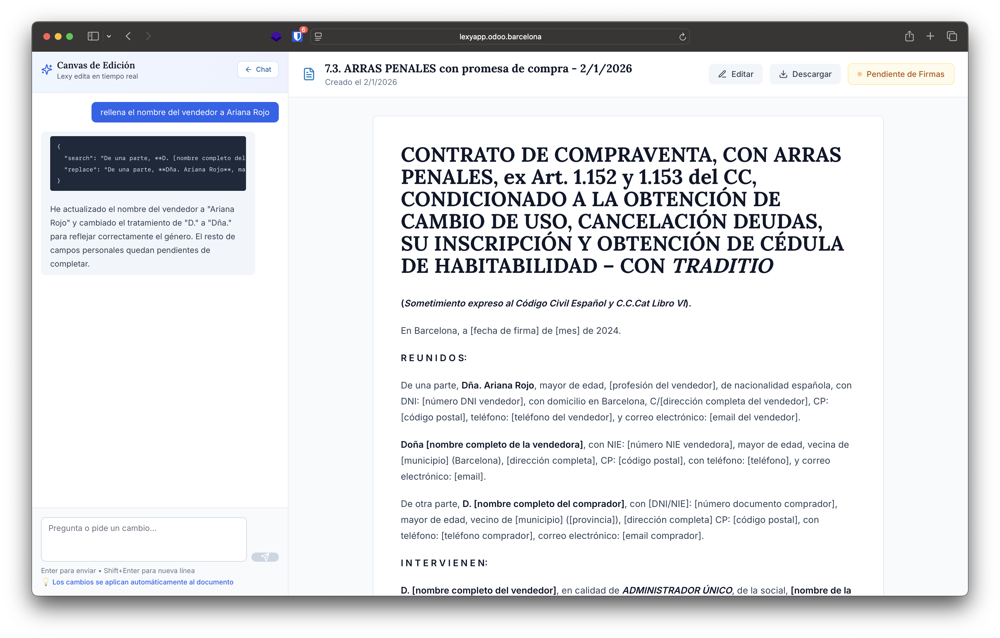
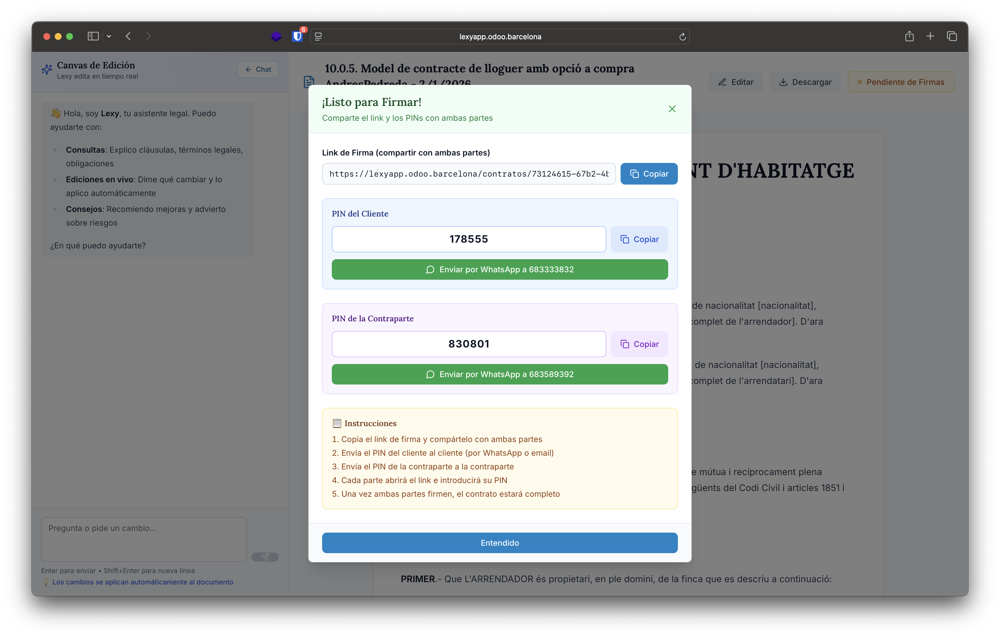

# LEXY - Tu Asistente Legal Inmobiliario con IA

> De conversación a contrato firmado en 4 pasos. Inteligencia artificial legal especializada para agentes inmobiliarios.

[](https://nextjs.org/)
[](https://react.dev/)
[](https://www.typescriptlang.org/)
[](https://tailwindcss.com/)
[](https://www.sanity.io/)
[](https://vercel.com)
[](LICENSE)

## 🌐 Live Demo

**🚀 [Ver Demo en Vivo](https://lexyweb.vercel.app)** ← Click aquí para ver la landing page

> **Nota:** El checkout de Stripe está desactivado hasta configurar las variables de entorno. La landing page funciona perfectamente.

### 📊 Estado del Proyecto

- ✅ **Landing page principal** - Diseño Apple-style minimalista
- ✅ **Landing /urgente** - Foco en conversión inmediata (30 segundos)
- ✅ **Blog con Sanity CMS** - Sistema completo sin código
- ✅ **Diseño ultra-minimalista** - Apple-style con emerald accents
- ✅ **Imágenes reales del producto** - 5 screenshots integrados
- ✅ **Deployed en Vercel** - Auto-deploy configurado con GitHub
- ✅ **Responsive design** - Mobile-first con Tailwind CSS 4
- ✅ **Animaciones fluidas** - Framer Motion
- ⏳ **Stripe checkout** - Pendiente configuración de variables de entorno

---

## 🎯 ¿Qué es LEXY?

LEXY es una plataforma SaaS que combina IA conversacional con generación automática de contratos legales para el sector inmobiliario. Sustituye semanas de trabajo legal por segundos de conversación.

**De 600€ por contrato a 65€/mes ilimitado.**

### ✨ Características principales

- 💬 **Consultas legales 24/7** - IA entrenada por abogados expertos
- 📄 **Generación de contratos en 30 segundos** - 97 plantillas profesionales
- ✏️ **Editor Canvas en tiempo real** - Edita cláusulas al instante
- ✍️ **Firma digital integrada** - Envía por WhatsApp, firma con PIN
- 📝 **Blog SEO optimizado** - CMS Sanity para contenido sin código
- 📚 **Todo centralizado** - Contratos + chats + firmas en un solo lugar

---

## 🖼️ Capturas de pantalla

### Dashboard principal


### Chat con Lexy


### Generación de contratos


### Editor Canvas


### Firma digital


---

## 🛠️ Tech Stack

### Frontend
- **[Next.js 16.1](https://nextjs.org/)** - React framework con App Router
- **[React 19.2](https://react.dev/)** - Server & Client Components
- **[TypeScript 5.9](https://www.typescriptlang.org/)** - Type safety
- **[Tailwind CSS 4.1](https://tailwindcss.com/)** - Utility-first CSS
- **[Framer Motion 12](https://www.framer.com/motion/)** - Animaciones fluidas

### CMS & Content
- **[Sanity.io](https://www.sanity.io/)** - Headless CMS para blog
- **[Portable Text](https://portabletext.org/)** - Rich text editing

### Payments
- **[Stripe](https://stripe.com/)** - Subscripciones con trial de 14 días

### Deployment
- **[Vercel](https://vercel.com/)** - Hosting optimizado para Next.js

---

## 🚀 Instalación local

### Prerrequisitos

- Node.js 18+ instalado
- npm o yarn
- Git

### Pasos

1. **Clona el repositorio**
```bash
git clone https://github.com/axeforeverjumo/lexyweb.git
cd lexyweb
```

2. **Instala dependencias**
```bash
npm install
```

3. **Configura variables de entorno**

Crea un archivo `.env.local` en la raíz:
```env
# Stripe (opcional - solo para pagos)
NEXT_PUBLIC_STRIPE_PUBLISHABLE_KEY=tu_clave_publica_stripe
STRIPE_SECRET_KEY=tu_clave_secreta_stripe
STRIPE_PRICE_ID=tu_price_id_del_plan_pro

# Sanity CMS (para blog)
NEXT_PUBLIC_SANITY_PROJECT_ID=s5r9o1yx
NEXT_PUBLIC_SANITY_DATASET=production
```

4. **Ejecuta el servidor de desarrollo**
```bash
npm run dev
```

5. **Abre tu navegador**
```
http://localhost:3000         # Landing principal
http://localhost:3000/urgente # Landing urgencia
http://localhost:3000/blog    # Blog
http://localhost:3000/studio  # CMS Sanity (requiere login)
```

### 📝 Configurar Blog (Sanity)

Si quieres usar el blog con Sanity CMS:

1. **Login en Sanity CLI**
```bash
npx sanity login
```

2. **Crear dataset**
```bash
npx sanity dataset create production
```

3. **Configurar CORS** (permite localhost:3000)
- Ve a: https://www.sanity.io/manage
- Selecciona proyecto `s5r9o1yx`
- API → CORS Origins → Add `http://localhost:3000`

4. **Accede al Studio**
```
http://localhost:3000/studio
```

📚 **Documentación completa**: [`docs/SANITY-IMPLEMENTACION-COMPLETA.md`](docs/SANITY-IMPLEMENTACION-COMPLETA.md)

---

## 📦 Scripts disponibles

```bash
npm run dev      # Inicia servidor de desarrollo
npm run build    # Crea build de producción
npm run start    # Inicia servidor de producción
npm run lint     # Ejecuta linter
```

### Scripts Sanity (Blog)

```bash
npx sanity login          # Login en Sanity CLI
npx sanity deploy         # Deploy Studio a Sanity Cloud
npx sanity manage         # Gestionar proyecto (abre navegador)
npx sanity dataset create # Crear nuevo dataset
```

---

## 🌍 Deploy a producción

### ✅ Proyecto ya deployed en Vercel

**URL Live:** [https://lexyweb.vercel.app](https://lexyweb.vercel.app)

**🔄 Deploy automático configurado:**
- Cada `git push` a `main` despliega automáticamente
- Build time: ~2 minutos
- Zero downtime deployments

### Configurar variables de entorno en Vercel (para Stripe)

Cuando quieras activar los pagos con Stripe:

1. Ve a [Vercel Dashboard](https://vercel.com/dashboard)
2. Selecciona el proyecto `lexyweb`
3. Settings → Environment Variables
4. Añade estas 3 variables:
   - `STRIPE_SECRET_KEY` - Tu clave secreta de Stripe
   - `STRIPE_PRICE_ID_PRO` - Price ID del plan Pro
   - `NEXT_PUBLIC_STRIPE_PUBLISHABLE_KEY` - Clave pública de Stripe
5. Vercel hará redeploy automáticamente

### Deploy manual (si es necesario)

```bash
# Instalar Vercel CLI
npm i -g vercel

# Login
vercel login

# Deploy
vercel --prod
```

---

## 📝 Pricing

### Plan Gratis
- 3 chats al año (consultas ilimitadas por chat)
- 2 contratos al mes
- Acceso a todas las plantillas

### Plan Pro - 65€/mes
- **Chats ilimitados**
- **Contratos ilimitados**
- 14 días de prueba gratis
- Sin permanencia

---

## 🎨 Diseño

Inspiración: **Apple-style minimalism**
- Fondo blanco limpio
- Naranja cálido (#FF6B35) como acento
- Tipografía: Manrope (200-800)
- Animaciones sutiles con Framer Motion

---

## 🤝 Contribuir

Las contribuciones son bienvenidas. Para cambios importantes:

1. Fork el proyecto
2. Crea una rama (`git checkout -b feature/NuevaCaracteristica`)
3. Commit tus cambios (`git commit -m 'feat: añadir nueva característica'`)
4. Push a la rama (`git push origin feature/NuevaCaracteristica`)
5. Abre un Pull Request

---

## 📄 Licencia

Este proyecto está bajo la licencia ISC.

---

## 📚 Documentación

### Guías Principales

- 📘 **[Implementación Sanity Completa](docs/SANITY-IMPLEMENTACION-COMPLETA.md)** - Documentación completa del blog CMS
- 📗 **[Setup Personal Sanity](docs/SETUP-SANITY-PERSONAL.md)** - Tu configuración específica (Project ID: s5r9o1yx)
- 📕 **[Quick Start Sanity](docs/SANITY-QUICKSTART.md)** - Comandos esenciales (5 min)
- 📙 **[Landing Urgente](docs/LANDING-URGENTE-IMPLEMENTACION.md)** - Spec landing /urgente

### Contenido

- 📝 **[Blog: Validez Legal IA](docs/CONTENIDO-BLOG-VALIDEZ-LEGAL.md)** - Artículo completo (5,200 palabras)

### Diseño

- 🎨 **[Restyling Guide](docs/RESTYLING.md)** - Sistema de diseño Apple-style con emerald

---

## 🔗 Links

- **🌐 Landing Principal**: [https://lexyweb.vercel.app](https://lexyweb.vercel.app) ✅ **LIVE**
- **⚡ Landing Urgente**: [https://lexyweb.vercel.app/urgente](https://lexyweb.vercel.app/urgente) ✅ **LIVE**
- **📝 Blog**: [https://lexyweb.vercel.app/blog](https://lexyweb.vercel.app/blog) ✅ **LIVE**
- **🎨 Studio CMS**: http://localhost:3000/studio (local) o https://lexy.sanity.studio (cloud)
- **📱 Aplicación**: [https://app.lexy.plus](https://app.lexy.plus)
- **💻 Repositorio**: [https://github.com/axeforeverjumo/lexyweb](https://github.com/axeforeverjumo/lexyweb)

---

## 👥 Equipo

Desarrollado con ❤️ para revolucionar el sector legal inmobiliario.

---

## 📧 Contacto

¿Preguntas? ¿Feedback? Contáctanos en [hola@lexy.plus](mailto:hola@lexy.plus)

---

**⚡ LEXY - Contratos inteligentes para agentes inteligentes**
