# Solución al Error 401 en Vercel - Supabase Environment Variables

## Problema

Al intentar iniciar sesión en la aplicación desplegada en Vercel, aparece el siguiente error:

```
POST https://supabase.odoo.barcelona/auth/v1/token?grant_type=password 401 (Unauthorized)
```

## Causa

Las variables de entorno `NEXT_PUBLIC_SUPABASE_URL` y `NEXT_PUBLIC_SUPABASE_ANON_KEY` **no están configuradas** en el proyecto de Vercel, por lo que el navegador no puede conectarse a Supabase.

**Importante**: Las variables en `.env.local` solo funcionan en desarrollo local. Vercel requiere configuración explícita.

## Solución

### Opción 1: Configuración Manual (Recomendado)

1. Ve a tu proyecto en [Vercel Dashboard](https://vercel.com/jmojedas-projects/lexyweb)
2. Navega a **Settings → Environment Variables**
3. Agrega las siguientes variables para **Production**, **Preview**, y **Development**:

| Variable | Valor |
|----------|-------|
| `NEXT_PUBLIC_SUPABASE_URL` | `https://supabase.odoo.barcelona` |
| `NEXT_PUBLIC_SUPABASE_ANON_KEY` | (Tu anon key de `.env.local`) |
| `NEXT_PUBLIC_APP_URL` | `https://lexy.plus` (Production) |

4. Después de configurar, haz un nuevo deployment:
   ```bash
   git commit --allow-empty -m "chore: trigger redeploy with env vars"
   git push origin main
   ```

### Opción 2: Script Automatizado

Ejecuta el script de configuración:

```bash
cd /Users/juanmanuelojedagarcia/Documents/develop/Desarrollos\ internos/lexyweb
./scripts/configure-vercel-env.sh
```

Este script:
- Lee las variables de `.env.local`
- Las configura en Vercel usando el CLI
- Las aplica a todos los entornos (Production, Preview, Development)

### Opción 3: Vercel CLI

```bash
# Desde la raíz del proyecto
vercel env pull .env.vercel  # Descargar variables actuales

# Agregar variables manualmente
vercel env add NEXT_PUBLIC_SUPABASE_URL production
vercel env add NEXT_PUBLIC_SUPABASE_ANON_KEY production

# Repetir para preview y development
```

## Verificación

### 1. Endpoint de Diagnóstico (API)
Visita: https://lexy.plus/api/debug-env

Verás un JSON con el estado de las variables de entorno en el servidor.

### 2. Página de Diagnóstico (UI)
Visita: https://lexy.plus/debug-env

Interfaz visual que muestra:
- ✅ Variables configuradas correctamente
- ❌ Variables faltantes
- 📦 Información del deployment
- 🛠️ Instrucciones de solución

### 3. Consola del Navegador
Abre DevTools → Console y verifica:
```javascript
console.log(process.env.NEXT_PUBLIC_SUPABASE_URL); // No debe ser undefined
```

## ¿Por qué pasó esto?

Next.js tiene dos tipos de variables de entorno:

1. **Variables privadas** (sin prefijo): Solo disponibles en el servidor
   - Ejemplo: `SUPABASE_SERVICE_ROLE_KEY`
   - No se incluyen en el bundle del navegador

2. **Variables públicas** (`NEXT_PUBLIC_*`): Disponibles en el navegador
   - Se **incrustan** en el bundle de JavaScript durante el build
   - Deben estar presentes en tiempo de build, no en runtime

En Vercel, aunque configuraste `env` en `next.config.js`, las variables solo se incrustan si están disponibles durante el build. `.env.local` no se sube a Vercel por seguridad.

## Pasos de Producción

```mermaid
graph TD
    A[Código local con .env.local] -->|git push| B[Vercel detecta push]
    B --> C{Variables de entorno en Vercel?}
    C -->|No| D[Build con variables undefined]
    C -->|Sí| E[Build con variables correctas]
    D --> F[Runtime: Error 401]
    E --> G[Runtime: Funciona ✅]
```



## Recursos

- [Next.js Environment Variables](https://nextjs.org/docs/basic-features/environment-variables)
- [Vercel Environment Variables](https://vercel.com/docs/concepts/projects/environment-variables)
- [Supabase with Next.js](https://supabase.com/docs/guides/auth/auth-helpers/nextjs)

## Commits Relacionados

- `f5fa6c1` - fix: explicit env vars in next.config and better debug
- `c1fc809` - chore: force redeploy to embed Supabase env vars
- `75e1a3b` - feat: crear dashboard con autenticación y scripts de diagnóstico

---

**Última actualización**: 28 enero 2026
**Estado**: Pendiente configuración de variables en Vercel
